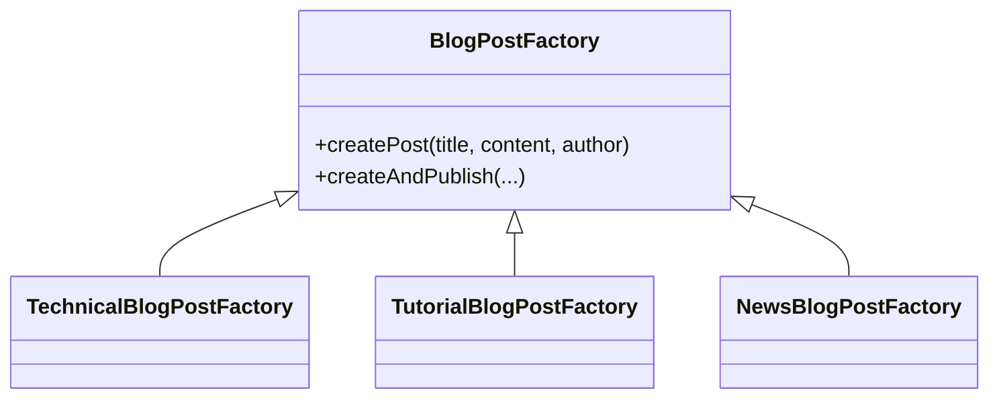
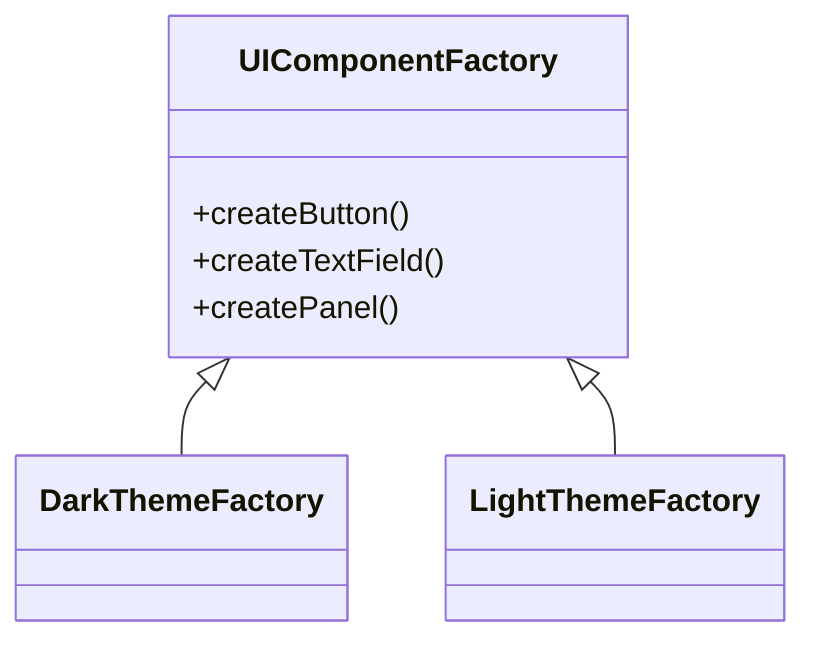
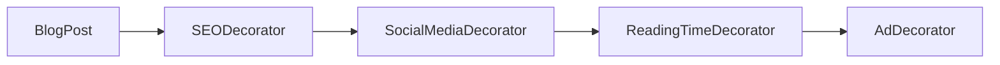
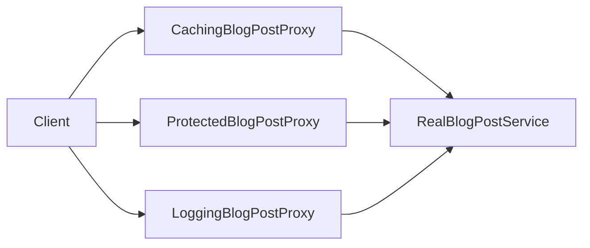
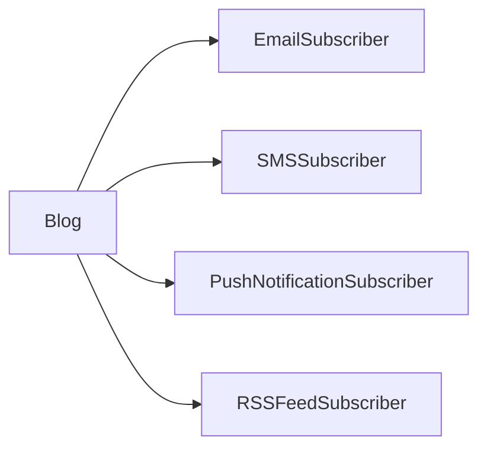
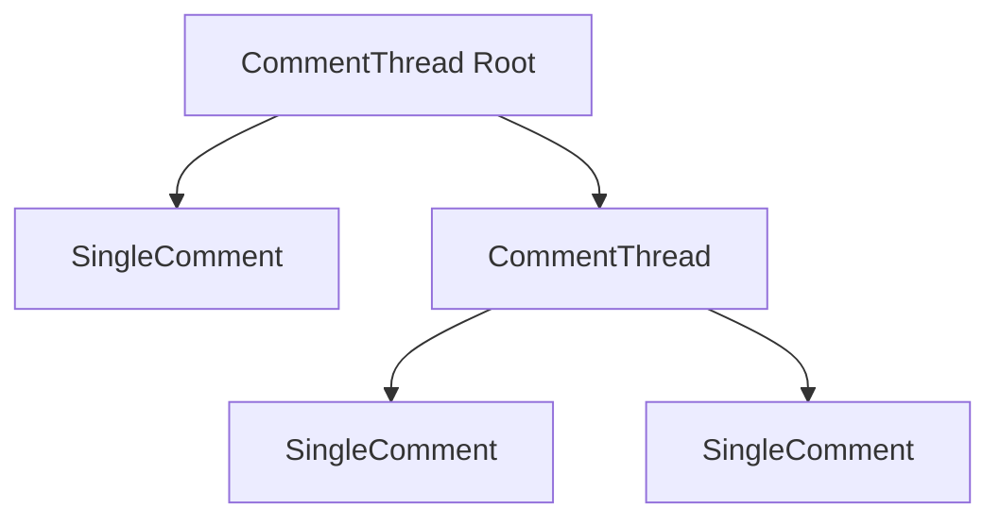
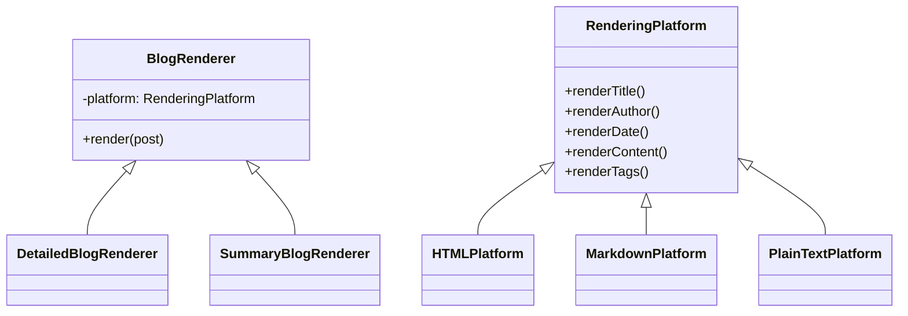
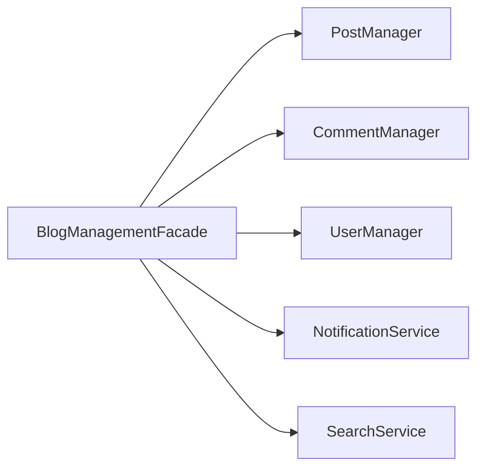

# Sơ Đồ Minh Họa Các Mẫu Thiết Kế – Hệ Thống Blog

## 1. Tổng quan quan hệ chính (Mermaid)
```mermaid
flowchart LR
  subgraph Creational
    A[BlogConfiguration (Singleton)]
    B[BlogPostFactory (Factory Method)]
    C[UIComponentFactory (Abstract Factory)]
    D[BlogPostBuilder (Builder)]
    E[BlogPostPrototype (Prototype)]
  end
  subgraph Structural
    F[LegacyBlogAdapter (Adapter)]
    G[BlogRenderer (Bridge)]
    H[CommentComponent (Composite)]
    I[BlogPostDecorator (Decorator)]
    J[BlogManagementFacade (Facade)]
    K[BlogPostProxy (Proxy)]
  end
  subgraph Behavioral
    L[BlogSubscriber (Observer)]
  end

  B -->|tạo| Post[BlogPost]
  D -->|xây dựng| Post
  E -->|clone| Post
  J -->|phối hợp| B
  J -->|phối hợp| L
  K -->|đại diện truy cập| Post
  I -->|bọc| Post
  F -->|chuyển đổi| Post
  G -->|render| Post
  H -->|quản lý| Comment[Comment Tree]
  L -->|nhận thông báo| Post
```

## 2. Factory Method (các triển khai)


## 3. Abstract Factory giao diện UI


## 4. Decorator xếp chồng


## 5. Proxy các biến thể


## 6. Observer thông báo đa kênh


## 7. Composite cây bình luận


## 8. Bridge renderer + platform


## 9. Facade phối hợp subsystem


## Ghi chú
- Các sơ đồ nhằm minh họa ý tưởng – không nhất thiết phản ánh mọi phương thức.
- Có thể mở rộng thêm sơ đồ Sequence cho luồng "publish bài".

## Liên kết
- `README.md`
- `PATTERNS_SUMMARY.md`
- `DESIGN_PATTERNS_PROBLEMS.md`
- `BAI_TOAN_CHI_TIET.md`
